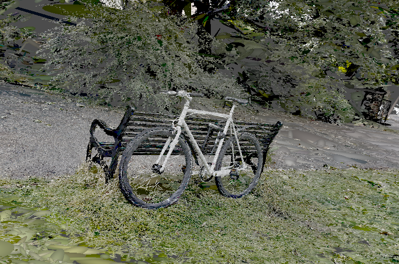
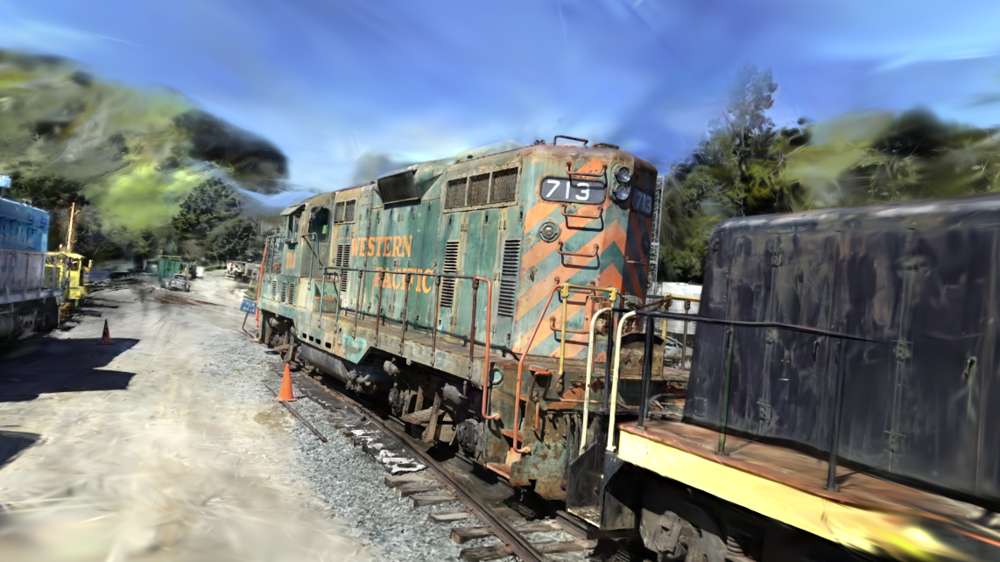

# Godot 3D Gaussian Splatting

This is a Godot 4 implementation of 3D Gaussian splatting. Godot doesn't provide order-independent transparency so the only way to get splats to draw in the correct order (as far as I could work out) is to use the RenderingServer API. The splat transformations/rendering are done in the splat.glsl shader and I use compute shaders to implement bitonic sorting for sorting the splats by depth. 

To try it out, define the "splat_filename" export as the .ply file you want to view. For the bigger files (> 1M splats) it takes a while to load - loading implementation is pretty dumb. There's also still bugs related to splat sorting/culling.

## Current Results

## TODO 
- better splat loading
- opengl to vulkan bugs - culling/projection matrix is incorrect i think
- add stuff info to readme
