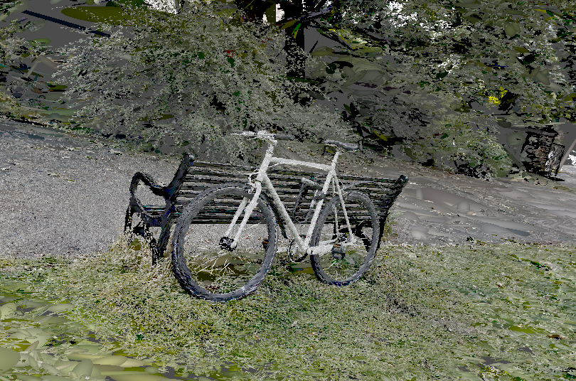
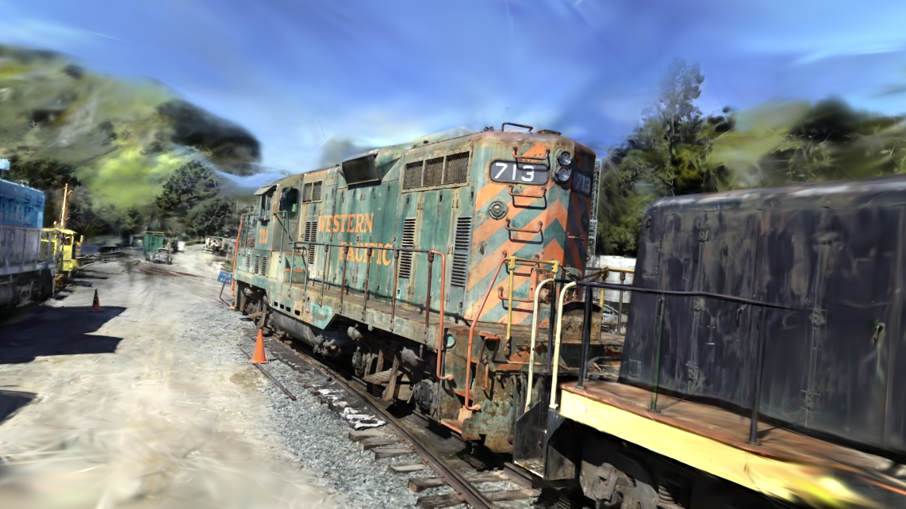
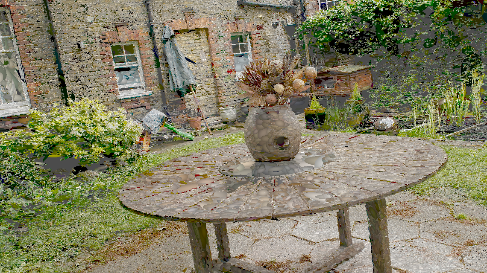

# Godot Gaussian Splat Viewer

Godot 4.6 implementation of a Gaussian splat viewer. The renderer uses a compute preprocess pass to project visible splats and build depth keys, then uses compute-shader radix sort to sort them back-to-front before drawing them as screen-aligned quads.

To try it out, define the `splat_filename` export as the `.ply` file you want to view.

## Example Views

